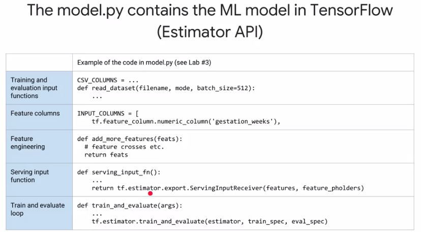
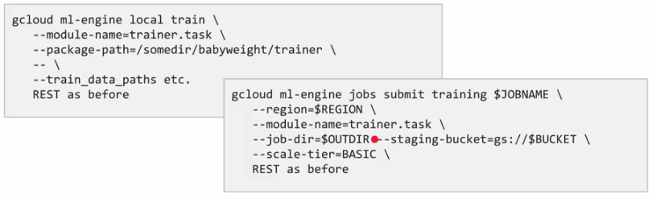

# End-to-End Machine Learning with Tensorflow on GCP

---

## Week 1

### Effective ML

1. To build effective ML you need:
- Big Data (implying batching and distribution).
- Feature Engineering (mostly due to human insights).
- Model Architectures (appropriate to the problem at hands).

### Fully managed ML

- Prototyping done with jupyer. Scaling done with GCP.
- ML Engine deals with distributing the training, scaling the number of machines necessary to make predictions, hyperparameter tuning, etc.

### Explore the dataset

- The most common types of models use tabular data.

### BigQuery

- BigQuery is a serverless data warehouse.
- Queries written using SQL 2011.
- Many ways to ingest, transform, load, and export data.

### Datalab

---

## Week 2

### Creating the dataset

1. What makes a feature "good"?

- Be related to the objective.
- Be known at prediction-time.
- Be numeric with meaningful magnitude.
- Have enough examples.
- Bring human insight to the problem.

2. Be mindful of data leakage

3. Prototyping should be made on a smaller subsample of the whole dataset. This makes debugging much faster. This can be achieved by using something like `RAND() < X`, during the SQL query.

4. If you hash some variable on your SQL query, you can get the same dataset everytime (by making choices based on the modulo of the hash). This also can be made so that information leakage is prevented. For instance, if you can have multiple instances on the same day that correspond to one single element, then hashing the year concatenated with the month, together with a choice based on the modulo of the hashing, can prevent this information leakage.

### Build the model

1. Think "steps", not "epochs" with production-ready distributed models:
- Gradient updates from slow workers could get ignored.
- When retraining a model with fresh data, we will resume from earlier number of steps (and correspodning hyper parameters).

### Hands-on Lab 3

1. Two types of features:
- Dense.
- Sparse.

2. DNNs are good for dense, highly-correlated inputs.

3. Linear models are better at handling sparse, independent features.

4. Wide-and-deep models let you handle both:
- Memorization relevance, from linear models.
- Generalization diversity, from DNNs.

5. During the lab the concept of _feature crosses_ is used. In tensorflow, this is implemented with hashing, and, since you are representing a number of variables on a smaller space, it is possible to have category collision (different categories pointing to the same hash). They mention that this is something we have to deal with, for the greater good of being able to use feature crosses (that help performance). Nonetheless they also suggest to include the original (uncrossed) features, so that the model has the chance of learning to distinguish example where hash collision occur.

---

## Week 3

### Operationalize the model

1. Key benefits of using Cloud Dataflow are:
- It allows us to process and transform large amounts of data in parallel.
- It supports both streaming and batch jobs.

2. Apache Beam:
- Is a unified model for defining both batch and streaming data parallel processing pipelines (sequences of steps that transform data from one thing to another).
- Set of language specific SDKs for constructing pipelines and runners for executing them on distributed processing backends.

3. Dataflow executes the code written using Apache Beam's API.

### Cloud ML engine

1. By convention `task.py` calls `model.py`.

2. Use gcloud command to submit trainings jobs locally or on the cloud.

3. The scale-tier defines the type of hardware and the number of instances, used to run a given job.

4. Monitor the jobs with GCP console and TensorBoard.

### BigQuery ML

_to add_

### Deploying and predicting with Cloud ML Engine

1. Cloud ML Engine makes deploying models and scaling the prediction infrastructure easy.

2. You can't reuse the training input function for serving

3. Three necessary steps:
- The `serving_input_fn()` specifies what the call of the `predict()` method must provide.
- Deploy a trained model to GCP.

- Client code can make REST Calls.

