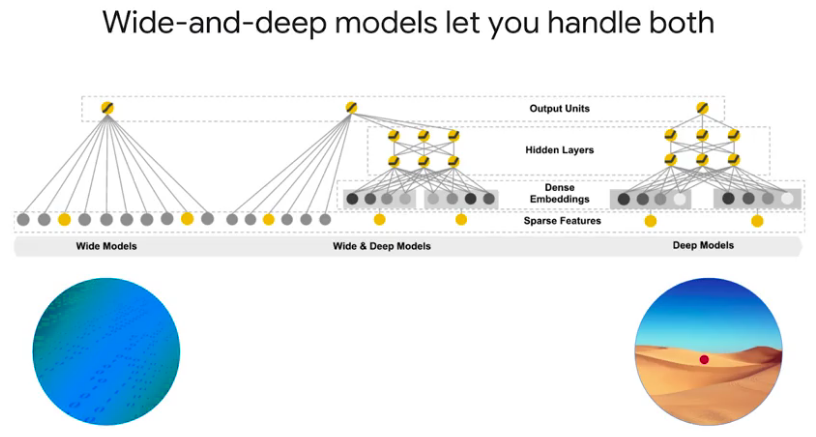

# End-to-End Machine Learning with Tensorflow on GCP

---

## Week 1

### Effective ML

1. To build effective ML you need:
- Big Data (implying batching and distribution).
- Feature Engineering (mostly due to human insights).
- Model Architectures (appropriate to the problem at hands).

### Fully managed ML

- Prototyping done with jupyer. Scaling done with GCP.
- ML Engine deals with distributing the training, scaling the number of machines necessary to make predictions, hyperparameter tuning, etc.

### Explore the dataset

- The most common types of models use tabular data.

### BigQuery

- BigQuery is a serverless data warehouse.
- Queries written using SQL 2011.
- Many ways to ingest, transform, load, and export data.

### Datalab

---

## Week 2

### Creating the dataset

1. What makes a feature "good"?

- Be related to the objective.
- Be known at prediction-time.
- Be numeric with meaningful magnitude.
- Have enough examples.
- Bring human insight to the problem.

2. Be mindful of data leakage

3. Prototyping should be made on a smaller subsample of the whole dataset. This makes debugging much faster. This can be achieved by using something like `RAND() < X`, during the SQL query.

4. If you hash some variable on your SQL query, you can get the same dataset everytime (by making choices based on the modulo of the hash). This also can be made so that information leakage is prevented. For instance, if you can have multiple instances on the same day that correspond to one single element, then hashing the year concatenated with the month, together with a choice based on the modulo of the hashing, can prevent this information leakage.

### Build the model

1. Think "steps", not "epochs" with production-ready distributed models:
- Gradient updates from slow workers could get ignored.
- When retraining a model with fresh data, we will resume from earlier number of steps (and correspodning hyper parameters).

### Hands-on Lab 3

1. Two types of features:
- Dense.
- Sparse.

2. DNNs are good for dense, highly-correlated inputs.

3. Linear models are better at handling sparse, independent features.

4. Wide-and-deep models let you handle both:
- Memorization relevance, from linear models.
- Generalization diversity, from DNNs.

---

## Week 3

_to be continued_