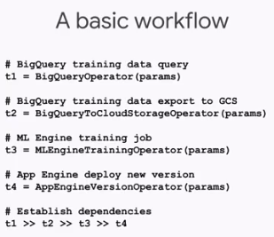
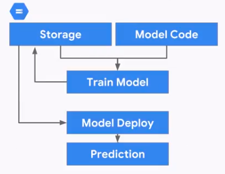
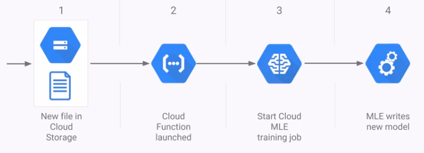
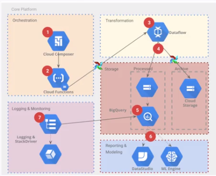
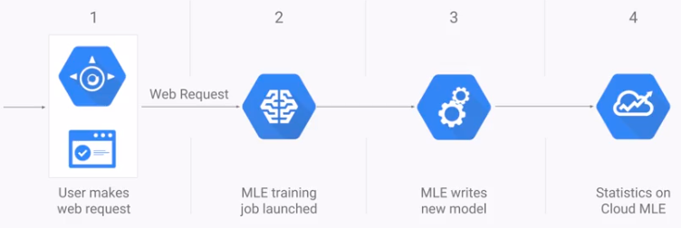
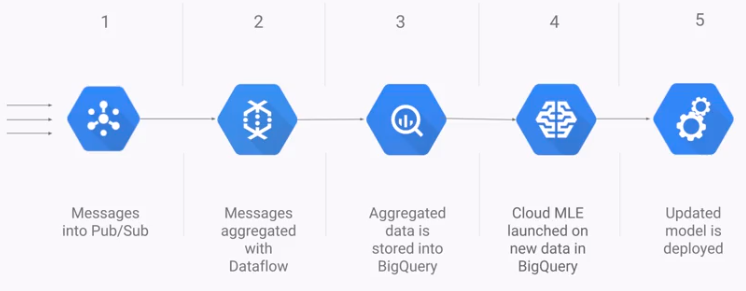
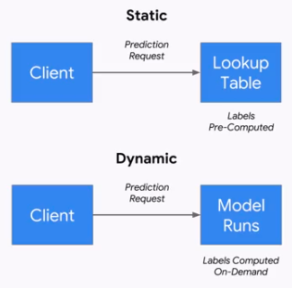
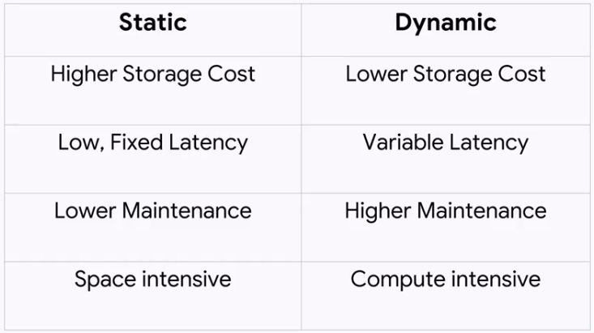
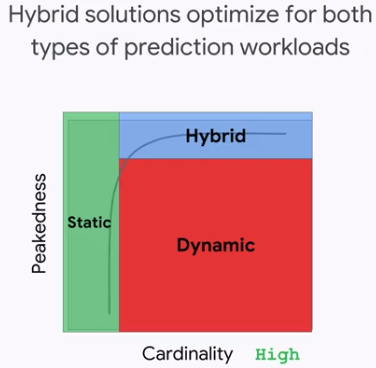
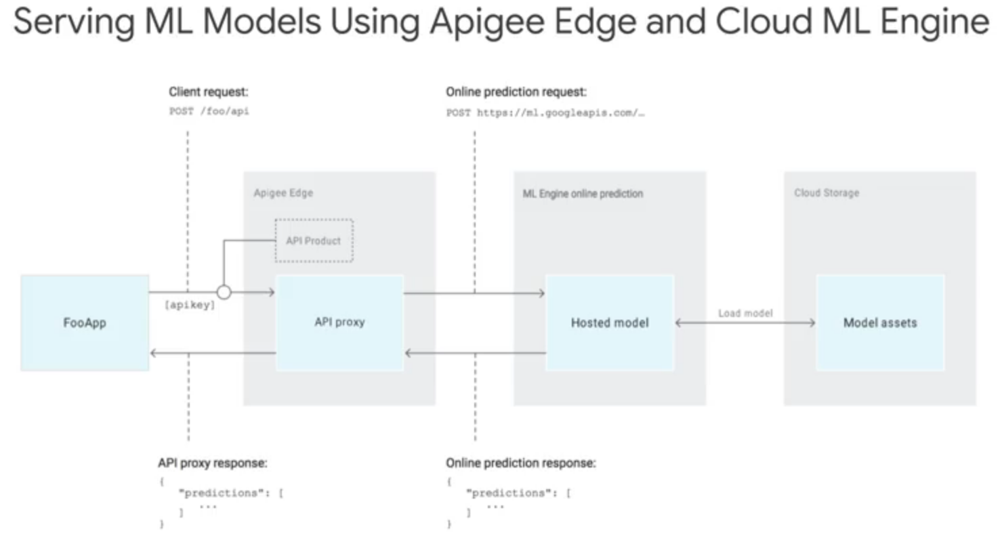

# Production ML Systems

---

## Week 1 - Architecting Production ML Systems

### The components of an ML system

#### Data ingestion
1. It might require streaming or batching.
2. GCP offers three solutions, PubSub, BigQuery, and Cloud Storage.

#### Data analysis
1. Poor data might introduce bugs that are really hard to catch.
2. Looking at its distribution is usually a good way of catching differences in its pattern.

#### Data validation
1. Some questions to understand whether the data is "healthy" or not (after a drop in performance):
- Is the new distribution similar enough to the old one?
- Are all expected features present?
- Are any unexpected features present?
- Do the features have the expected type?
- Does an expected proportion of the examples contain the feature?
- Do the examples have the expected number of values for feature?

#### Data transformation
1. Tranformations used at training should be also used at serving time.
2. GCP offer solutions such as Dataflow, Dataproc, and Dataprep

#### Trainer
1. It should support data and model parallelism, while scaling for multiple workers.
2. It should log and monitor key metrics, as well as support experimentation.
3. It should support hyperparameter tuning.
4. GCP offers ML Engine and GKE (Kubeflow).

#### Tuner
1. ML Engine support different strategies of hyperparameter tuning.

#### Model evaluation and validation
1. Ensures that the models are good before moving them into production.
2. Two main characteristics:
- It's safe (unlikely to crash, robust, and efficient)
- It outputs good predictions
3. Models are first evaluated offline.
4. Model validation ensures that there are warnings when certain thresholds are reached.
5. GCP offers this through TFX Model Analysis.

#### Serving
1. The serving component must be:
- Low latency
- Highly efficient
- Scale horizontally
- Reliable and robust
- Easy to update versions
2. GCP offers this through ML Engine and TF Serving (through kubernetes).

#### Logging
1. All logs should be easily accessible and integrated-
2. Offered through Cloud Reliability.

#### Shared config
1. Not having shared configuration might result in glue code, code written to join parts together. It's common when research teams write production code without taking the whole project into consideration. To solve this:
- Establish a common architecture for both R&D and production deployment
- Embed the teams together, so that engineering can influence the design of code from its inception
2. Orchestration glues all the components together. On GCP it is done with Cloud Composer. Another option is to use Argo, on GKE (Google Kubernetes Engine).3. Steps to compose a workflow in cloud composer:
- Define the Ops
- Arrange into a DAG
- Upload to the environment
- Explore DAG Run in Web UI

#### Integrated frontend
1. The users of the system need to be able to easily accomplish their tasks, and as central a location as possible.
2. GCP offers ML Engine and TensorBoard.

#### Pipeline storage
1. Offered through Cloud Storage.

---

### Week 1 - Design Decisions

#### Training design decisions
1. Training might be static or dynamic. The major difference between them is that dynamic training requires the deployed model to keep gathering data, to re-train itself.

2. Examples:
- Spam detection -> Static or dynamic (depending on how quickly spammers change)
- Android voice to text -> Static (global model) or Dynamic (personalized model)
- Shopping an conversion rate -> Static

3. Commonly, you might want to use dynamic, but in practice you start with static, since it's simpler.

4. Reference architecture for static training

5. There are three potential architectures for dynamic training:
- Cloud Functions (for asynchronous training jobs)
- App Engine (for user-triggered training jobs)
- Cloud Dataflow (for continuous training)

6. Using Cloud Functions:

7. Using Cloud Composer:

8. Using AppEngine:

9. Using Dataflow

#### Serving design decisions
1. It is possible to serve statically or dinamically. The decision is based on a tradeoff between storage costs, CPU costs, and latency.

2. We might also think about in terms of:
- *Peakedness*, which is how concentrated the distribution is
- *Cardinality*, number of values in the set

3. The peakedness vs cardinality space gives us which type of serving to use. The hybrid approach has the most common values stored, and the long tail being dinamically computed, as requested.

4. Examples:
- Spam detection -> Dynamic (low peakedness, high cardinality)
- Android voice to text -> Dynamic/hybrid
- Shopping ad conversion rate -> Static

5. Until now we've used dynamic serving (request in, model predicts, and we output it). If we were to use a static approach, we would have to make the following changes:
- Change Cloud MLE from online to batch prediction job
- Model accepts and passes keys as input
- Write predictions to a data warehouse (e.g. BigQuery)

#### Serving on Cloud MLE

