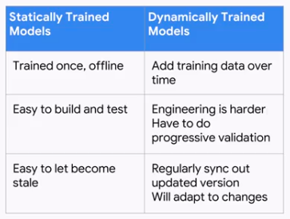
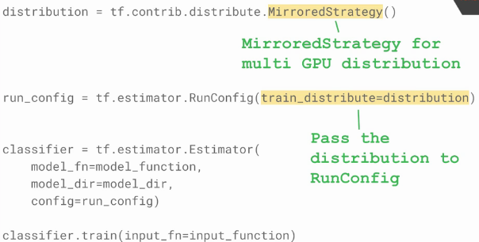

# Production ML Systems

---

## Week 1 - Architecting Production ML Systems

### The components of an ML system

#### Data ingestion
1. It might require streaming or batching.
2. GCP offers three solutions, PubSub (streaming), BigQuery (structured batch), and Cloud Storage (unstructured batch, for example, to train on that data later).

#### Data analysis
1. Poor data might introduce bugs that are really hard to catch.
2. Looking at its distribution is usually a good way of catching differences in its pattern.

#### Data validation
1. Some questions to understand whether the data is "healthy" or not (after a drop in performance):
- Is the new distribution similar enough to the old one?
- Are all expected features present?
- Are any unexpected features present?
- Do the features have the expected type?
- Does an expected proportion of the examples contain the feature?
- Do the examples have the expected number of values for feature?

#### Data transformation
1. Tranformations used at training should be also used at serving time.
2. GCP offer solutions such as Dataflow, Dataproc, and Dataprep

#### Trainer
1. It should support data and model parallelism, while scaling for multiple workers.
2. It should log and monitor key metrics, as well as support experimentation.
3. It should support hyperparameter tuning.
4. GCP offers ML Engine and GKE (Kubeflow).

#### Tuner
1. ML Engine support different strategies of hyperparameter tuning.

#### Model evaluation and validation
1. Ensures that the models are good before moving them into production.
2. Two main characteristics:
- It's safe (unlikely to crash, robust, and efficient)
- It outputs good predictions
3. Models are first evaluated offline.
4. Model validation ensures that there are warnings when certain thresholds are reached.
5. GCP offers this through TFX Model Analysis.

#### Serving
1. The serving component must be:
- Low latency
- Highly efficient
- Scale horizontally
- Reliable and robust
- Easy to update versions
2. GCP offers this through ML Engine and TF Serving (through kubernetes).

#### Logging
1. All logs should be easily accessible and integrated-
2. Offered through Cloud Reliability.

#### Shared config
1. Not having shared configuration might result in glue code, code written to join parts together. It's common when research teams write production code without taking the whole project into consideration. To solve this:
- Establish a common architecture for both R&D and production deployment
- Embed the teams together, so that engineering can influence the design of code from its inception
2. Orchestration glues all the components together. On GCP it is done with Cloud Composer. Another option is to use Argo, on GKE (Google Kubernetes Engine).3. Steps to compose a workflow in cloud composer:
- Define the Ops
- Arrange into a DAG
- Upload to the environment
- Explore DAG Run in Web UI

#### Integrated frontend
1. The users of the system need to be able to easily accomplish their tasks, and as central a location as possible.
2. GCP offers ML Engine and TensorBoard.

#### Pipeline storage
1. Offered through Cloud Storage.

### Design Decisions

#### Training design decisions
1. Training might be static or dynamic. The major difference between them is that dynamic training requires the deployed model to keep gathering data, to re-train itself.

2. Examples:
- Spam detection -> Static or dynamic (depending on how quickly spammers change)
- Android voice to text -> Static (global model) or Dynamic (personalized model)
- Shopping an conversion rate -> Static

3. Commonly, you might want to use dynamic, but in practice you start with static, since it's simpler.

4. Reference architecture for static training

5. There are three potential architectures for dynamic training:
- Cloud Functions (for asynchronous training jobs)
- App Engine (for user-triggered training jobs)
- Cloud Dataflow (for continuous training)

6. Using Cloud Functions:

7. Using Cloud Composer:

8. Using AppEngine:

9. Using Dataflow

#### Serving design decisions
1. It is possible to serve statically or dinamically. The decision is based on a tradeoff between storage costs, CPU costs, and latency.

2. We might also think about in terms of:
- *Peakedness*, which is how concentrated the distribution is
- *Cardinality*, number of values in the set

3. The peakedness vs cardinality space gives us which type of serving to use. The hybrid approach has the most common values stored, and the long tail being dinamically computed, as requested.

4. Examples:
- Spam detection -> Dynamic (low peakedness, high cardinality)
- Android voice to text -> Dynamic/hybrid
- Shopping ad conversion rate -> Static

5. Until now we've used dynamic serving (request in, model predicts, and we output it). If we were to use a static approach, we would have to make the following changes:
- Change Cloud MLE from online to batch prediction job
- Model accepts and passes keys as input
- Write predictions to a data warehouse (e.g. BigQuery)

### Serving on Cloud MLE

### Designing an Architecture from Scratch

1. Things to keep in mind:
- What sort of training architecture is appropriate?
- What is the relationship between the features and labels like?
- Reasoning about the peakedness and cardinality of the data.

---

## Week 1 - Ingesting Data for Cloud-Based Analytics and ML

### Introduction

1. Data must be on the cloud to be leveraged by ML models.

2. Some challenges to get the data onto the cloud:
- Too much data
- Too little bandwidth
- Checksumming, encryption, firewalls
- No time and few resources

3. How to get your data on GCP?

### Data Scenarios - Data On-Premise

1. Simply drag and drop into a GCP bucket.

2. Use `gsutil` to move the data.

3. `gsutil` has several "expected" commands. Using the flag `-m` enables multi-threading.

4. There are 4 types of GC storage:

### Data Scenarios - Large Datasets

1. Large means > 60TB of data.

2. It is possible to use a physical google device, called _Transfer Appliance_, a high-capacity storage server (1PB).

3. If online transfer would take more than a week, then use transfer appliance.

4. Networks bottleneck at big data scale

### Data Scenarios - Data on Other Clouds

1. `gsutil` allows you to transfer data from buckets setup on other regions, or even from S3 instances, etc.

2. It is possible to use the _transfer service_, using the GUI.

### Data Scenarios - Existing Databases

1. Choosing where your data should be stores

2. Examples:
- Structured log data from monitoring IoT applications -> BigTable or Spanner
- Migrating your data analytics and reporting warehouse -> BigQuery
- Existing legacy Hadoop jobs -> DataProc (and run those jobs inside of a fully managed service)

3. BigQuery data transfer service

4. Migrate databases to Cloud SQL/Spanner/Big Table

5. Migrate Hadoop or HDFS to Cloud Dataproc

### Demo: Automatic ETL Pipelines into GCP

1. ETL Pattern 1: Push solution architecture. This architecture is best for those wanting ad-hoc or invent based loading.

2. ETL Pattern 2: Pull solution architecture. This architecture is best when you have repeatable processes and scheduled intervals.

---

## Week 2 - Designing Adaptable ML Systems

### Adapting to Data

1. Things that might change with time and affect performance of the model:
- The upstream model
- Data sources maintained by another teams
- The relationship between features and labels (e.g. correlations that might hold only for certain splits of the data)
- The distribution of inputs

### Adapting to Data - Changing Distributions

1. It can happen that either labels or features change their distributions over time.

2. Extrapolation (generalize outside the bounds of what the model has seen on the training data) vs Interpolation (generalize within the bounds of the training data).

3. How to protect yourself from distribution changes:
- Monitor descriptive statistics for your inputs and outputs
- Monitor your residuals (difference between the predictions and your labels) as a function of your inputs
- Use custom weights in your loss function to emphasize data recency
- Use a dynamic training architecture and regularly retrain your model

4. _Legacy features_, are older features added at the time because they were valuable, but since then redundant with better features that were added afterwards.

5. _Bundled features_, are features added as part of a bundle, which are valuable collectively, but might not be individually.

6. Both legacy and bundled features represent additional unnecessary data dependencies.

7. There is _code smell_ in ML development as well. This is connected to "code that we can't inspect and are unable to easily modify, but that's added nonetheless to production frameworks".

### Adapting to Data - Right and Wrong Decisions

1. Some decisions are a matter of weighting cost versus benefit, such as short-term performance goals against long-term maintainability. Other are plainly about right and wrong.

2. Examples:
- Data leakage (e.g. using data that is not available at inference time, cross-contamination, etc.)

### Adapting to Data - System Failure

1. System fail - For example in e-commerce, if the transaction and payment server goes down on a certain time-period, the model sees data where people click on products, but don't buy them. One possible solution would be to roll back the model to a time prior to the model polution.

2. Feedback loops - Models have to be updated with regard to new users, new products, and new patterns. This is known as the cold start problem. The solution would be to dynamically retrain the model on newer data, besides undestanding the limits of the model. This is also true on adversarial environments, such as fraud detection.

### Mitigating Training-Serving Skew

1. Caused by:
- A discrepancy between how you handle data in the training and serving pipelines
- A change in the data between when you train and when you serve
- A feedback loop between your model and your algorithm

2. How code can create it:
- Different library versions that are functionally equivalent but optimized differently
- Different library versions that are not functionally equivalent
- Re-implemented solutions

### Lab: Serving ML Predictions in batch and real-time

[code](https://github.com/GoogleCloudPlatform/training-data-analyst/tree/master/courses/machine_learning/deepdive/06_structured/serving)

### Debugging a Production Model

1. Example - Predicting widget demand

2. Suddenly sales and inventory storage is down
- Feedback loop! Bad data -> ML Model -> Predicts low demand -> Product turnover increases -> ML Model
- Also a reminder that we often optimize for someting other than what we ultimate care about. In this case we were optimizing for matching predicted demand, when what we cared about was minimizing carrying costs in order to maximize profits.

3. Avoid treating dependent entries as independent, as they might fool the model.

4. Pause deployment whenever something out of the ordinary happens (avoids collecting poor data).

### Summary

1. Keep humans in the loop.

2. Prioritize maintainability.

3. Get ready to roll back.

---

## Week 2 - Designing High-performance ML Systems

### Introduction

1. Some problems require optimizing IO speed, others computational speed. Different focus requires different ML infrastructure.

2. Main solutions are:
- Better specific hardware
- Distributed systems
- Different model architectures

### Aspects of Performance - Training

1. One key aspect of ML is the time it takes to train the model to the same accuracy (or whatever metric being considered).

2. One of the things to consider is a training budget:
- Time
- Money
- Scale

3. Example: Imagine you need to train a model everyday. 
- You are capped at something like 18h, to accomodate for the other parts. 
- In terms of cost, you don't want to spend the money training a model if the business uplift doesn't outscale that cost. 
- Finally, time and cost budget dictate the data set size, as larger datasets generally yield better results, but suffer more from diminishing returns. Another aspects to consider is to decider whether to use a single machine or to distribute training, as well as using early checkpoint to resume your training.

4. There are typically 3 constraints:

### Aspects of Performance - Predictions

1. The time spent during predictions is also a key aspect.

2. The things to consider for batch prediction are fairly similar to the ones mentioned on the previous subsection.

3. Online predictions are different:
- Single machine -> Can be scaled to multiple workers using microservices (Kubernetes or App Engine. Cloud ML Engine predictions make the equivalent to this).
- The performance target is QPS (queries per second).

4. Some considerations, as having the top X% predictions stored and served in batch, and the rest online, might be helpful. These values are often better defined after the system is already implemented.

### Aspects of Performance - Why distributed training?

1. In order to provide flexibility to different ways of scaling performance, the code has to allow the user to use different approaches.

2. Distributed training allows you to process data faster.

### Aspects of Performance - Distributed training architectures?

1. Device == worker == accelerator, and refer to things as GPUs, TPUs.

2. There are different approaches to distributed training, and the chosen one is based on:
- Size of the model
- Amount of training data
- The available devices

3. The most common approach is _data parallelism_, i.e., the same model on different devices, but all using different training samples.

4. There are two approaches to data parallelism:
- _Async parameter server_:  Some devices are designated to be parameter servers and other to be workers. Each worker independently fetches the latest parameters from the parameter server, and computes gradients based on a subset of training samples. It then sends the gradients back to the parameter server which updates its copy of the parameters with those gradients. Each worker can do this independently. The upside from this approach is that it scales easily, workers might be preempted by higher priority jobs, and it's resilient to machines going down, since the workers are not waiting for each other. The downside is that workers can get out of sync, delaying convergence.

- _Sync Allreduce_: Each worker (on one host) holds a copy of the model, and updates the gradients based on the input samples that they receive, and then communicate them between themselves. Since workers are synchronized, the next step of optimization will only begin after all the workers have received the updated their parameters based on all gradients. With devices on a controlled environment and with strong communication links, the overhead of synchronization is also small. Therefore, overall it can lead to faster convergence.

5. When to choose each of the approaches?

6. Besides data parallelism, it is also possible to use _model parallelism_. This is important when working with larger models, and we can split the different layers among different workers.

### Faster input pipelines - Faster input pipelines

1. Always useful, regardless of the approach (data/model parallelism). Nonetheless, it's more important if are IO bound.

2. It is particularly important if we are using distributed training, where we have to "feed" several different workers.

3. Slowest to fastest approaches
- Directly feed from Python (slowest)
- Native TF Ops
- Read transformed TF records (fastest)

### Faster input pipelines - Native TF operations

1. Since key functions make use of C++, it's important to don't take it back to Python back again.

2. Notice the shuffle. It is necessary due to the nature of _data parallelism_. In particular, we read 10 times the batch size, shuffle it, and then serve one batch at each time. This will, hopefully, make each worker hold the data on a different order.

### Faster input pipelines - TF Records

1. Fast efficient batch reads, without the overhead of having to parse data in Python.

### Faster input pipelines - Parallel pipelines

1. Input pipelines can be thought of as an ETL process:
- Extract: Read the data from persistent storage
- Transform: Use CPU cores to parse and perform preprocessing operations
- Load: Load the transform data onto the accelerator devices

2. Example using TF Records approach

3. This leads to an input pipeline bottleneck. If we overlap the different stages, which are using different resources, we can improve perfomance by doing something called _pipelining_.

4. These are down by using `num_parallel_reads`, `num_parallel_calls`, and `buffer_size` on the previous example.

5. This leads to:

6. Other possible way of improving performance is by fusing steps:

### Data Parallelism - All Reduce

1. Example:

- Leads to:

2. Mirrored strategy implements synchronous all-reduce architecture. The model's parameters are mirrorred across all devices. Each device compute loss and gradients based on a slice of the input data, which are then aggregated across all devices using an all reduce algorithm, that is best for the device topology. Furthermore:
- No change to the model or training loop
- No change to input function (requires `tf.data.Dataset`)
- Checkpoints and summaries are seamless

### Parameter server approach

1. Although not as clean and simple as the all reduce approach, it is more mature and it is applicable to both data and model parallelism.

2. To use it, all you need to do is to use an estimator and call the train and evaluation methods. Cloud ML, for instance, will choose the appropriate low level code for the chosen estimator.

### Inference

1. There are different requirements to consider:
- Queries per second
- Latency, meaning how long does a query takes
- Costs, in terms of infrastructure and maintenance

2. Approaches
- REST/HTTP API for streaming pipelines
- Cloud ML Engine for batch pipelines
- Cloud dataflow that can deal with streaming and batch

3. In inference, batch referes to a bounded dataset.

4. Performance for batch pipelines

5. Performance for streaming pipelines

---

## Week 2 - Hybrid ML Systems

### Introduction

1. You might not be able to do ML solely on google cloud services
- Tied to on-premise infrastructure
- Multi cloud system architecture
- Running ML on the device itself

### Kubeflow - ML on hybrid cloud

1. In order to build hybrid ML systems that work well on-premises and in the cloud, your ML framework has to support
- Composability: Ability to compose a bunch of micro-services among the different steps of a ML system
- Portability: How is easy is it to port the steps of our approach from the experimentation environment to the training/cloud environments
- Scalability: More everything

### Kubeflow - Kubeflow

1. Kubeflow is a machine learning toolkit for Kubernetes.

2. Offers composability and portability.

### Optimizing TF for mobile - Embedded Models

1. Increasingly, applications are combining ML with mobile apps.

2. ML models can help extract meaning from raw data, thus reducing network traffic:

3. For mobile devices, we often can't use the microservices approach.

4. We'd like to train the model, embed the model on the device, and make predictions on the device.

### Optimizing TF for mobile - TF Lite

1. TF Lite:
- Reduced code footprint
- Quantization
- Lower precision arithmetic

2. A new topic of research is federated learning, where the model is continuously trained on the device, and then you combine the model updates from a federation of user devices to update the overall model.

### Optimizing TF for mobile - Optimizing for mobile

1. Large neural networks can be compressed:
- _Freeze graph_: Load time optimization, with the setback of no longer being possible to retrain the model, as variables are now constants. It also removes checkpoints.
- _Transform the graph_: Strip unused nodes, in particular, nodes only used during training; Transform multiples operations into single operations.
- _Quantize weights and calculations_: Quantize weights, which is model size/accuracy tradeoff.

2. These changes can reduce the size of a model from 91MB (12MB binary) to 23MB (1.5MB binary).

