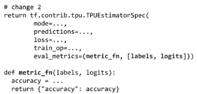

# Image Understanding with TensorFlow on GCP

---

## Week 1 - Images as Visual Data

### Structured vs Unstructured Data

1. Comparing feature vectors with straight-line distance does not work well for unstructured data.

2. These models are not invariant to significant translations.

## Week 1 - DNNs with Dropout for Image Classification

### What is Dropout?

1. We might not want to use a very large DNN:
- Computational power might not be enough
- It might take too long to train
- It is more likely to overfit

2. One of the best ways of fighting overfitting is using regularization. Besides methods like L1 and L2, it is also possible to use dropout.

3. Dropout means we are "dropping" certain weights from the network randomly, thus creating different architectures at each step. We can think of it like an ensemble of NNs.

## Week 1 - Introducing CNNs

### Understanding Convolutions

1. A convolution is an operation that processes groups of nearby pixels.

2. Convolutional layers are collections of filters.

3. Convolution kernel, is a matrix of weights that multiplies a "submatrix" of the image. The output shape is reduced by (kernel size minus one), e.g. for a kernel size of 3 it would reduce by 2, along each dimension of the input.

4. A kernel of :
- [1 2 1; 0 0 0; -1 -2 -1] detects horizontal edges
- The transpose of the above would detect vertical edges
- A kernel of [0 -1 0; -1 4 -1; 0 -1 0] detects brighters spots

5. The output of a convolution has depth equal to the number of kernels applied (number of filters).

### CNN Model Parameters

1. _Padding_ adds extra column and rows of numbers around the original matrix.

2. If we're using square kernels and the size of the kernel side is an odd number, we take the length of the kernel side, subtract one, and then divide that in half. That gives us the required thickness of the border (padding) to preserve the shape of the input. E.g. for a kernel of 3, we would need to add padding equal to 1.

3. It is better to do more layers of smaller filters. For instance instead of one layer using a 9x9 kernel, use two of 3x3 kernels.

4. _Stride_ gives us the number of pixels the kernel moves horizontally and vertically when processing the input. If its value is too high, then parts of the input might be ignored. In most cases we want to use a stride equal to, or smaller, than the kernel size.

5. Using stride > 1 will reduce the shape of the output. In this case, the input is divided along both axis by the stride value. E.g., for 28x28 inputs, and stride equal to 2, the output will be 14x14.

6. When training a CNN, we're learning the weights of the previously mentioned kernels. This means that we are learning the filters that extract the most important features from the data, for a given problem.

7. One of advantages of the CNN is requiring a smaller number of parameters.

### Working with Pooling Layers

1. _Maxpooling_ also reduces the dimension of the original image, both vertically and horizontally. It has as parameters a size and stride. In this case, as the name implies, it is chosen the maximum value of a given "pool" of values being seen at each step.

---

## Week 2 - Data Augmentation

### The Data Scarcity Problem

1. Data need grows with model complexity (number of parameters).

2. What do you do when you don't have enough data?
- Data augmentation
- Transfer learning

### Data Augmentation

1. One strategy is to _look for clusters_, but this doesn't work very well for unstructured problems.

2. Another strategy is to _perturb individual data points_.

3. In terms of images there are a lot of common transformations, such as flipping vertically/horizontally, increasing saturation, brightness, changing hue, cropping, flipping, zooming, etc.

4. But, it's important to keep in mind the problem we are solving, as some of the things we are changing might be important features. For example:
- We might change the color of the original image.
- We might flip the image and remove information about the order of colors.
- We might blur the image and lose information on the details of some pattern.
- If we add transformations that will never happen on production we might hinder the model's performance.

5. Sometimes, it might be interesting to augment data at decision time, and make an ensemble of all the predictions.

6. Augmentation is done at runtime. Making it beforehand would make us use more disk than necessary. It ends up being a tradeoff between time to apply the transformation and disk constraints.

7. It is normal to apply random transformations each time the image is used.

8. It is helpful in terms of optimization to transform the input value from [0, 1] to [-1, 1].

## Week 2 - Transfer Learning

1. Instead of creating more data, it reduces our need for more data.

2. Imagine optimization as a travel between an initial point and the optimum final point, where the cost is data and time. If we start on a random point and we don't have enough data, we are probably going to get stuck somewhere along the way. Transfer learning is helpful because it makes us start from a better initial point.

3. The more similar the task used to pre-train the model, the easier it is to get to the optimum.

4. The layer closer to the output are more task-dependent.

5. The decision on how to fine-tune is the following:
- First we replace the output specific layer (the one with output dimension equal to the number of classes)
- Then, we have to decide on how many layers of the convolutional part we unfreeze. If we have a smal dataset, we freeze the model; if we have a large dataset, we unfreeze more layers.

## Week 3 - No data, No problem

1. If we have no labeled data at all we can:
- Use a pre-trained model on a task close enough to ours
- Find a partner to label our data (there's a GCP solution for that)

## Week 3 - Going Deeper, Faster

1. The closer the layers to the classification/task specific layers, the more intricate the learned features are.

2. Deeper networks require different sets of considerations to be trainable, ideally, fast.

## Week 3 - Batch Normalization, Residual Networks, and Accelerators

### Batch Normalization

1. One of the culprits of long training times is _internal covariant shift_. This basically happens because we are updating the weights of certain layers based on values of previous layers, that might no longer be the optimal. This eventually make neurons enter the saturation zone of the non-linearities being used, and thus, they stop learning.

2. One of the approaches to solve this is to lower the learning rate. But this increases the training time.

3. One other approach is to use dropout. But this could hinder the possibility of the some layers fully exploring the data.

4. A better solution is to use batch normalization, i.e. scaling the weights between layers. In particular, they're transformed in a way that the weights of a given layer have average zero and standard deviation of one. This helps the model being trained while having more layers, but also to train faster. Batch normalization is only done during training.

### Residual Networks

1. One other issue with deep networks is the gradient preservation, in particular vanishing gradients. Batch normalization only works to some extent in this case.

2. ResNets approaches this problem by introducing a different, repeating architecture, that makes use of an "identity shortcut". In particular, instead of trying to learn a mapping between the input and the output, that becomes harder for deeper networks, this network is trying to learn the difference between the desired output and the original inputs.

### Accelerators (CPU vs GPU/TPU)

1. GPUs enabled much faster training.

2. TPUs are application specific chips (ASICs), custom built for machine learning.

## Week 3 - TPU Estimator

### TPU Estimator

1. 4 steps to make a TPUEstimator:
- Replace our optimizer
- Replace our EstimatorSpec
- Replace our RunConfig
- Replace our Estimator

2. Things to consider:
- User higher batch size, to avoid waiting for disk operations.
- Checkpoint less often
- Use data parallelism
- First make sure the code work without TPU, and then use it. That's because TPUs change the graph, and that makes debugging much harder

3. More things to consider:
- TPUS have 4 chips, each chip has 2 cores, and each core has 8GB memory. Finally, there are 64 TPUs per pod
- TPUs provide high-speed interconnect: Scaling with the number of cores is pretty much linear
- TPUs offer much larger matrix multiplication
- TPUs are most efficient with batches of 128, or multiples of it
- TPUs have a specialized instruction set
- TPUs use bfloat (different representation of 16bit), or float32 floating point representation. The maximum benefir comes from using bfloat, and furthermore, even you use float32, the matrix multiply will be carried out in bfloat. So, cases that absolutely require double-precision arithmetic are not a good fit for TPUs

## Week 3 - Neural Architecture Search (NAS)

### Neural Architecture Search

1. Its goal is to automate the building of models

2. It is possible to use RL to design NNs, by repeating the following cycle:

 
3. This is one of the key concepts of AutoML

4. With the rise of AutoML approaches, the main focus will be on:
- Data discovery, curation, processing
- Asking good questions, choosing good models
