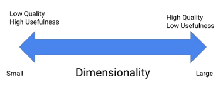

# Sequence Models fot Time Series and Natural Language Processing

---

## Week 1 - Working with Sequences

### Working with Sequences

1. Sequences are data points that can be meaningfully ordered, such that earlier observations provide information about later observations. You should also be able to take a slice of observations and use those to get a better than chance prediction of some later observations.

2. Types of Sequence Models:
- One-to-sequence
- Sequence-to-one
- Sequence-to-sequence

3. If we want to transform a sequence of values in features, by concatenating the values (something like [t0, ..., t10; t1, ..., t11; ...; tseqlen-10, ..., tseqlen]), we will use a sliding window with a certain _n_. In the end, we will have _t-n_ rows with _n_ entries, where in this case, t = seqlen and n = 10.

4. In order to choose a good _lag_ value it is possible to use autocorrelation graphs.

5. Sometimes time dependencies are known, and thus, it is possible to choose a suitable time lag based on that.

### Modelling Sequences with Linear Models

### Modelling Sequences with DNNs

1. Sometimes it is important that models agree with how we think the underlying relationship between the features and the labels works.

2. We might want more recent observations to be more important. This can be obtained with exponential smoothing.

### Modelling Sequences with CNNs

1. Locality is important for both images and sequences.

2. A deeper model is more specific (the same as with deep CNNs, whose deeper layers capture more specific patterns).

3. Steps in applying a convolution:
- Flatten the input sequence.
- Use `conv1d` to apply a number of filters to the sequence.
- Use `max_pooling1d` to add some spatial invariance and downscaling.
- Flatten the resulting output into a sequence.
- Send it through a fully connected layer with the appropriate output node.

### The variable-length problem

1. In the sequence domain it is important that models are robust to changes in the length of the pattern.

2. Two techniques to handle variable length inputs and outputs:
- Cutting and padding.
- Bagging.

3. By padding we end up multiplying by zero certain inputs.

4. By cutting to the shortest sequence-length we end up losing information.

5. Bagging does not hold information about the sequence (as it does something like the average of all).

---

## Week 1 - Recurrent Neural Networks

### Recurrent Neural Networks

1. Formulate the problem as "Representing a single event given what has come before".

2. Two key ideas:
- RNNs learn a compact hidden state that represents the past.
- The input to a RNN is a concatenation of the original, stateless input and the hidden state.

3. Optimized with backpropagation through time (each parameter is updated using the average of the partial derivatives from out iterations).

4. With RNNs the output isn't just a class label, it's a sequence.

5. These models might learn representations and memorize patterns, but are unable to learn relationships between concepts.

6. RNNs are subject to the problem of vanishing gradient.

---

## Week 1 - Dealing with Longer Sequences

### LSTMs, GRUs, and RNNs in TensorFlow

1. Problem with long term dependencies.

2. LSTM cells

3. GRUs have similar performance, and computationally more efficient.

5. A simple RNN has 1 matrix of weights, a LSTM has 4, and GRUs have 3. The number of matrixes does not depend on the number of time steps.

6. Implementing one in TensorFlow:

### Deep RNNs

1. Deep RNNs in TensorFlow.

2. Usually we only take into account the values from the last layer.

### Improving our Loss Function

1. If for instance we use only the last prediction to classify a whole sequence, measure the loss not only on the final prediction in the sequence, but for the last _k_ time steps. Then it is possible to use the average of those losses for a more robust value.

### Training with real data

1. If we have a long sequence, we can split it into smaller sequences, which are easier to train.

2. When splitting up sequences, there are two things to consider: the length of the sequences, and how much they overlap.

3. If we don't overlap continuous sequences we can propagate the info between splits, by initializing the hidden states of the next split with the last hidden state of the previous split.

4. It also might be necessary to predict multiple time steps ahead. One way to tackle this issue is to feed a prediction to the model, and keep proceeding like this with predicted inputs. The more predicted inputs we use, the more error we are adding.

5. It might be useful to "resample data". For instance, by averaging all available points for one day.

6. It is also possible to use different models for different sensors, assuming they are providing different information. A better way to tackle this would be to enrich the model with some discrete variable, regarding the location of the sensor, for instance. These kind of features should be added to the final DNN layer.

---

## Week 2 - Text Classification

### Introduction

1. Convert sentences into a numeric representation
- Create a mapping from each word to a unique integer
- Encode each sentence as a sequence of those integers
- Pad each sequence to a constant length
- Convert each integer into an embedded representation with meaningful magnitude

2. We usually encode only the top K most common words.

### Selecting a Model

1. CNNs have good properties for text classification.

### Python vs Native Tensorflow

1. Our code has to be ready to receive only text, and preprocess it at runtime.

2. This should be done in native TensorFlow for better performance. The good thing of writing this directly in TensorFlow is that we can make it work in any device.

3. Example of the needed transformations:

---

## Week 2 - Reusable Embeddings

### Word Embeddings

1. A fundamental concept is "The Distributional Hypothesis".

2. Matrix factorization:
- Creates smaller embeddings row and column domains.
- Widely used in machine learning.

3. Matrix factorization minimizes reconstruction error:

4. Trading off quality and usefulness with dimensionality

5. Matrix factorization can be very expensive.

6. It is possible to formulate this as a supervised task, by training a model that learns to predict a word given its context.

7. A well known approach to this problem is called word2vec.

8. Normal cross-entropy is impractical in this case, because of the number of classes. A good way to overcome this is by using negative sampling, meaning that on the denominator we only sum over a subset of the classes. In particular, we use all the positive words (which are less) and only sample part of the negative words (which are all the other words which are not part of the context).

9. A possible way of further reducing the complexity of the task is by removing common words (such as "A", "the", etc.).

10. Word2vec embeddings are compositional.

11. GloVe is a hybrid between matrix factorization and window-based methods, taking advantage of co-occurrence matrixes.

12. Pre-trained embeddings work well for general-purpose tasks.

---

## Week 2 - Encoder-Decoder Models

### Encoder-Decoder Networks

1. It follows the following logic:

2. The best way to decode in inference time is through beam search.

3. It is possible to improve these models with attention networks.

4. To train such a model in TF we have to:
- Embed
- Encode
- Attend
- Predict

5. To add attention:

6. It is possible to use Tensor2Tensor to solve these kind of tasks.

### AutoML and DialogFlow

1. It is possible to apply AutoML to Machine Translation.

2. To obtain conversational interfaces it is possible to use DialogFlow.