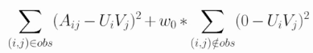
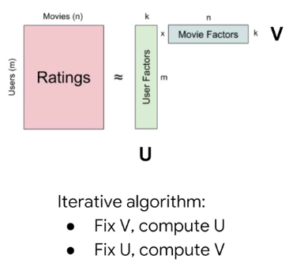

# Recommendation Systems with TensorFlow on GCP

---

## Week 1 - Course Overview

## Week 1 - Recommendation Systems

1. Recommendation systems:
- Help users find related content.
- Help users explore new items.
- Improve user decision making.

2. For producers:
- Increase user engagement.
- Learn more about customers.
- Change user behavior.

3. Recommendation systems provide a way to model people's preferences.

4. One of the core concepts is the `user-item` matrix, where rows are users, and columns are items.

5. Types of recommendation systems:
- Content-based recommender system.
- Collaborative filtering.
- Knowledge-based.
- Deep neural networks.

6. _Content-based filtering_ uses item features to recommend new items similar to what the user has liked in the past.

7. _Collaborative filtering_ uses similarities between users and items simultaneously to determine recommendations. It often involves matrix factorization.

8. _Knowledge-based_ recommender systems use explicit knowledge about the users, items, and recommendation criteria.

9. _Deep neural networks_ can combine information such as sequences of previously seen videos, genres, artists, etc., and train it to correctly predict the user rating to a given video.

10. Recommender systems pitfalls:
- The user and produce spaces are _sparse_ (most items are rated by very few users and most users only rate a small portion of items), and _skewed_ (some properties are very popular and some users are very prolific).
- There's the problem of _cold start_ when there are not enough interactions for a given user or item.

11. Explicit feedback is often rare or unobservable. It is much more common to use implicit feedback mechanisms: number of clicks, play counts, fraction of the video watched, site navigation, time spent on page, etc.

## Week 1 - Building a Simple Vector-Based Model

1. If we have embeddings of items we can use similarity functions to calculate which products are more similar between themselves.

2. It is possible to create a _user feature vector_ (given the properties of the items, and the ratings given by the user).

3. Having user feature vectors, it is possible to find _user item ratings_ to make recommendations (given the user feature vector, and the properties of the items).

4. If we have multiple users we stack the several matrices into a tensor, shaped as (#users, #movies, #features).

## Week 1 - Building a Content-Based Recommendation System with a Neural Network

1. It is possible to user user + movie features to train a model with a given objective (star rating, movie id, next content id, etc.)

## Week 1 - ALS, Matrix Factorization Algorithm for Collaborative Filtering

1. Content-based recommendations use similarities between items in an embedding space. This might be a limitation.

2. Collaborative filtering learns latent factors and can explore outside the user's personal bubble.

3. Collaborative filtering recommendations use similarities between item and users simultaneously in an embedding space.

4. It is based on a user-item matrix. Sometimes it is based on explicit feedback (rating), but most often it uses implicit feedback (user behavior with regard to a given item).

5. We can organize items according to several dimensions. Users will be categorized according to those dimensions as well. Then, it is possible to find how well a pair of user-item matches by taking the dot product between the two vectors.

6. These item and users embeddings might be learned from data. In particular, the data is compressed to find the best generalities to rely on, called _latent factors_.

7. Steps of collaborative filtering:
- Factorize user-interactions matrix into user-factors and item-factors.
- Given user ID, multiply by item-factors to get predicted ratings for all items.
- Return top k rated items for this user.

8. Factorizing the matrix resembles the problem of least squares. There are several ways to solve it:
- SGD (Flexible, Parallel, but it is Slow, Hard to handle unobserved interaction pairs)
- Alternating Least Squares, ALS (Parallel, Fast, Easily handles unobserved interaction pairs, but only works for Least Squares)

9. To handle unobserved user-interaction matrix pairs it is possible to use SVD, which sets all missing values to zero, or ALS, which ignores the missing values.

9. It is also possible to use a Weighted ALS (WALS), which uses weights instead of zeros.

10. The ALS algorithm alternates between rows and columns to factorize tha matrix, as follows:

11. To transform data (such as `userid` and `itemid`) into something that can be used by the ALS algorithm, we need to create a mapping function for those values.

12. Even though the update depends on the full column factor, it is possible to distribute WALS by precomputing the Gramian G (Gramian is the determinant if the matrix inner product X transpose X).

## Week 1 - Implementing ALS in TensorFlow

1. WALS requires whole rows or columns, therefore the data has to be preprocessed to provide SparseTensors of rows/columns.

2. WALS Matrix Factorization Estimator:

3. The input function has to read the files and create sparse tensors for the rows and columns.

4. Decode the TF Record files and invoke sparse_merge to create the necessary SparseTensor.

5. Remap keys to SparseTensor to fix re-indexing after batching

6. Typically only the top K items by user are stored (or vice-versa).

7. Tensorflow Transform uses Cloud DataFlow in the analysis stage to create assets that TensorFlow uses in training and prediction:
- Read Google Analytics data from BigQuery.
- TF-Transform for analysis.
- Transform function that TF will use.
- Create vocabulary of VisitorID -> UserId and ContentId->ItemID
- Create the group-by dataset
- Convert to TF Records
- Write to cloud storage

8. Collaborative filtering.
- Pros: No domain knowledge; Serendipity; Great starting point.
- Cons: Fresh items/users?; Context features?

9. To solve cold-start problems we might use a hybrid of content+collaborative filtering.

---

## Week 2 - Neural Networks for Recommendation Systems

1. Real-world recommendation systems are a hybrid of three broad theoretical approaches:

2. Designing a movie recommendation system.
- Content based ideas:

- Collaborative filtering ideas:

- Knowledge-base systems ideas:

## Week 2 - Incorporating Context

1. Example of context components
- Mood at the time
- Where you are
- Who you are with
- When you are experiencing the item
- etc.

2. Context-aware recommendation systems (CARS)
- Matrix is: users x items x context

3. 